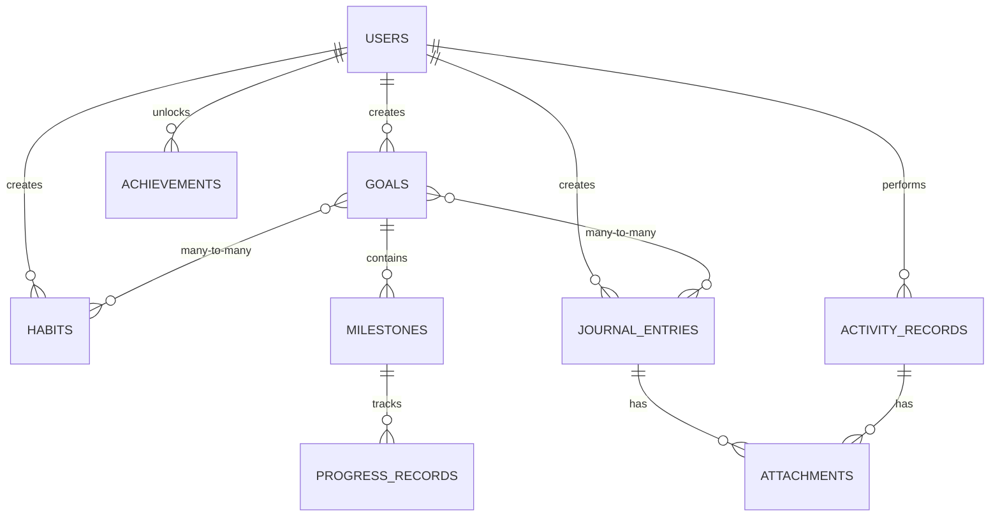

# GrowthOS Database Design (Phase 2)

## 1. Conceptual ERD



## 2. Logical ERD (Table Definitions)

### Core Tables

#### `profiles` (Extended User Data)
- `id`: UUID (FK to auth.users)
- `display_name`: TEXT
- `email`: TEXT
- `growth_points`: INTEGER DEFAULT 0
- `created_at`: TIMESTAMPTZ

#### `goals`
- `id`: UUID (PK)
- `user_id`: UUID (FK to profiles)
- `title`: TEXT
- `description`: TEXT
- `category`: GOAL_CATEGORY (Enum)
- `level`: GOAL_LEVEL (Enum)
- `status`: GOAL_STATUS (Enum)
- `deadline`: TIMESTAMPTZ
- `created_at`: TIMESTAMPTZ

#### `milestones`
- `id`: UUID (PK)
- `goal_id`: UUID (FK to goals)
- `title`: TEXT
- `is_completed`: BOOLEAN DEFAULT FALSE
- `deadline`: TIMESTAMPTZ
- `created_at`: TIMESTAMPTZ

#### `progress_records`
- `id`: UUID (PK)
- `milestone_id`: UUID (FK to milestones)
- `value`: NUMERIC
- `notes`: TEXT
- `date`: DATE

#### `habits`
- `id`: UUID (PK)
- `user_id`: UUID (FK to profiles)
- `title`: TEXT
- `type`: HABIT_TYPE (BINARY, QUANTITATIVE)
- `is_good`: BOOLEAN
- `frequency`: FREQUENCY (DAILY, WEEKLY)
- `created_at`: TIMESTAMPTZ

#### `habit_logs`
- `id`: UUID (PK)
- `habit_id`: UUID (FK to habits)
- `status`: HABIT_STATUS (DONE, PARTIAL, MISSED)
- `value`: NUMERIC
- `date`: DATE

#### `journal_entries`
- `id`: UUID (PK)
- `user_id`: UUID (FK to profiles)
- `title`: TEXT
- `content`: TEXT
- `mood`: INTEGER (1-10)
- `entry_date`: DATE
- `created_at`: TIMESTAMPTZ

#### `activity_records`
- `id`: UUID (PK)
- `user_id`: UUID (FK to profiles)
- `event_type`: EVENT_TYPE (JOURNAL_CREATED, etc.)
- `source_type`: TEXT
- `source_id`: UUID
- `points_earned`: INTEGER
- `created_at`: TIMESTAMPTZ

#### `achievements`
- `id`: UUID (PK)
- `title`: TEXT
- `description`: TEXT
- `points_value`: INTEGER
- `type`: ACHIEVEMENT_TYPE (SYSTEM, USER)
- `unlocked_at`: TIMESTAMPTZ (For system global)

### Junction Tables (Many-to-Many)

#### `goal_habits`
- `goal_id`: UUID (FK to goals)
- `habit_id`: UUID (FK to habits)
- primary key (goal_id, habit_id)

#### `goal_journals`
- `goal_id`: UUID (FK to goals)
- `journal_id`: UUID (FK to journal_entries)
- primary key (goal_id, journal_id)

## 3. Physical Schema (PostgreSQL)

```sql
-- Enums
CREATE TYPE goal_category AS ENUM ('EDUCATION', 'PERSONAL', 'FITNESS', 'TRADING', 'CAREER', 'FINANCE');
CREATE TYPE goal_level AS ENUM ('S', 'A', 'B', 'C');
CREATE TYPE goal_status AS ENUM ('ACTIVE', 'COMPLETED', 'ON_HOLD', 'OVERDUE');
CREATE TYPE habit_status AS ENUM ('DONE', 'PARTIAL', 'MISSED');
CREATE TYPE event_type AS ENUM ('JOURNAL_CREATED', 'HABIT_COMPLETED', 'GOAL_COMPLETED', 'MILESTONE_COMPLETED', 'WORKOUT_LOGGED', 'TRADE_REVIEWED', 'CUSTOM');

-- Tables
CREATE TABLE profiles (
    id UUID PRIMARY KEY REFERENCES auth.users(id),
    email TEXT,
    display_name TEXT,
    growth_points INTEGER DEFAULT 0,
    created_at TIMESTAMPTZ DEFAULT NOW()
);

CREATE TABLE goals (
    id UUID PRIMARY KEY DEFAULT gen_random_uuid(),
    user_id UUID NOT NULL REFERENCES profiles(id),
    title TEXT NOT NULL,
    description TEXT,
    category goal_category NOT NULL,
    level goal_level NOT NULL,
    status goal_status DEFAULT 'ACTIVE',
    deadline TIMESTAMPTZ,
    created_at TIMESTAMPTZ DEFAULT NOW()
);

-- RLS
ALTER TABLE goals ENABLE ROW LEVEL SECURITY;
CREATE POLICY "Users can manage their own goals" ON goals
    FOR ALL USING (auth.uid() = user_id);

-- Indexes
CREATE INDEX idx_goals_user_id ON goals(user_id);
CREATE INDEX idx_goals_category ON goals(category);
```

## 4. Security & Performance (Supabase Context)

### RLS Strategy
- Every table containing personal user data (goals, habits, journal, records) will include a `user_id` column.
- The standard policy will be: `CREATE POLICY "owner_access" ON "table_name" FOR ALL USING (auth.uid() = user_id);`

### Indexing Strategy
- **Foreign Keys**: All FK columns (user_id, goal_id, milestone_id) will be indexed for performance in joins.
- **Date Filtering**: Columns like `entry_date` and `date` will be indexed to support rapid filtering for dashboards and analytics.
- **Search**: Trigram indexes (using `pg_trgm`) may be added to `goals.title` and `journal_entries.content` for efficient keyword search.
