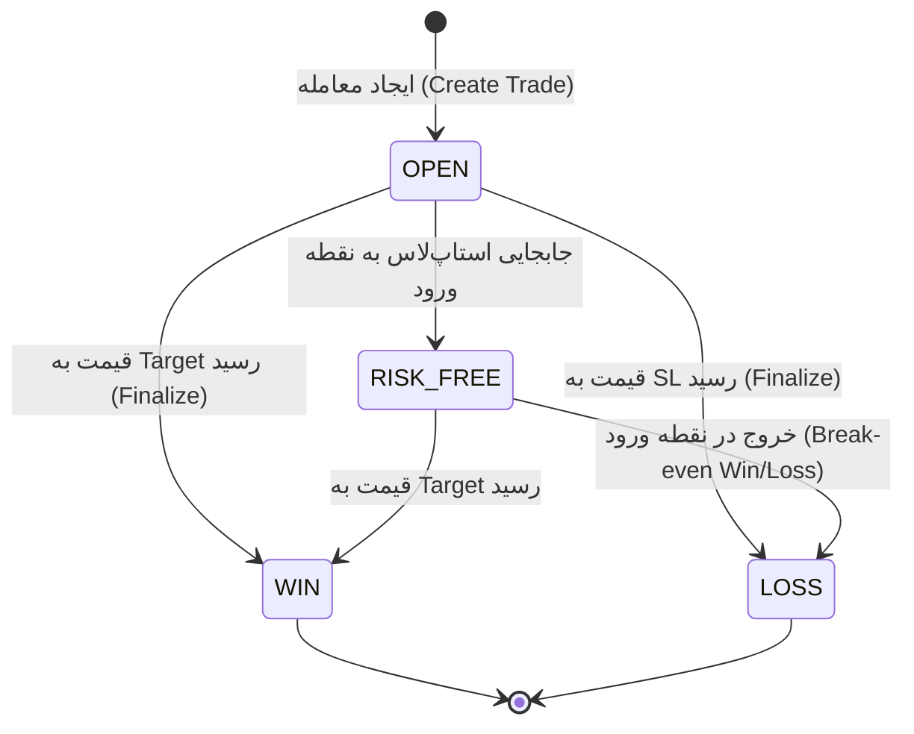

# Domain Model - GrowthOS (Phase 1)

## ۱. موجودیت‌ها (Entities)

در این بخش، موجودیت‌های اصلی سیستم به همراه ویژگی‌ها (Attributes) و نوع داده‌ای آن‌ها تعریف شده‌اند.

### ۱.۱. هدف بزرگ (BigGoal)
نمایانگر یک هدف بلندمدت که باید به قطعات کوچک‌تر تقسیم شود.
- **id**: Long (PK)
- **title**: String (عنوان هدف)
- **description**: String
- **startDate**: Date
- **endDate**: Date
- **totalExpectedSessions**: Int (تعداد کل جلسات مورد نیاز)
- **category**: Enum (EDUCATION, PERSONAL, PROJECT)
- **status**: Enum (ACTIVE, COMPLETED, ON_HOLD)

### ۱.۲. برنامه زمانی جلسات (GoalSchedule)
برنامه‌ریزی دقیق برای هر بخش از هدف بزرگ.
- **id**: Long (PK)
- **goalId**: Long (FK)
- **scheduledDate**: Date
- **sessionTitle**: String
- **isCompleted**: Boolean
- **completionDate**: Date
- **notes**: String

### ۱.۳. عادت خوب (GoodHabit)
فعالیت‌های مثبت تکرارپذیر.
- **id**: Long (PK)
- **name**: String
- **frequency**: Enum (DAILY, WEEKLY, CUSTOM)
- **targetDaysOfWeek**: List<Int> (مثلاً شنبه و دوشنبه)
- **reminderTime**: String (Time)

### ۱.۴. ثبت انجام عادت خوب (GoodHabitCompletion)
- **id**: Long (PK)
- **habitId**: Long (FK)
- **date**: Date
- **status**: Enum (DONE, PARTIAL, MISSED)
- **value**: Double (اختیاری - مثلاً مقدار مطالعه به دقیقه)

### ۱.۵. عادت بد (BadHabit)
فعالیت‌های غیرضروری که باید کاهش یابند.
- **id**: Long (PK)
- **name**: String (مثلاً اسکرول کردن اینستاگرام)
- **category**: Enum (SOCIAL_MEDIA, GAMING, NEWS, OTHER)

### ۱.۶. ثبت زمان عادت بد (BadHabitLog)
- **id**: Long (PK)
- **badHabitId**: Long (FK)
- **date**: Date
- **durationMinutes**: Int (مدت زمان تلف شده)
- **replacementActivityId**: Long (FK - عادت خوبی که می‌توانست جایگزین شود)

### ۱.۷. معامله (Trade)
اطلاعات مربوط به ترید در بازارهای مالی.
- **id**: Long (PK)
- **marketType**: Enum (FOREX, CRYPTO)
- **symbol**: String (نام ارز یا جفت‌ارز)
- **entryPrice**: Double
- **stopLoss**: Double
- **targetPrice**: Double
- **leverage**: Double (مخصوص کریپتو)
- **lotSize**: Double (مخصوص فارکس)
- **fee**: Double
- **spread**: Double
- **status**: Enum (OPEN, WIN, LOSS, RISK_FREE)
- **reflectionReason**: String (دلیل سود یا ضرر)
- **closingDate**: Date

### ۱.۸. ورودی ژورنال (JournalEntry)
- **id**: Long (PK)
- **date**: Date
- **content**: String (Markdown)
- **moodEmoji**: String
- **energyLevel**: Int (1-10)

### ۱.۹. یادداشت (Note)
- **id**: Long (PK)
- **title**: String
- **body**: String (Markdown)
- **tags**: List<String>
- **createdAt**: DateTime

---

## ۲. روابط (Relationships)

ارتباطات بین موجودیت‌ها به شرح زیر است:

- **BigGoal (1) ----< (Many) GoalSchedule**: هر هدف بزرگ شامل چندین جلسه برنامه‌ریزی شده است.
- **GoodHabit (1) ----< (Many) GoodHabitCompletion**: هر عادت خوب در طول زمان چندین بار ثبت می‌شود.
- **BadHabit (1) ----< (Many) BadHabitLog**: هر عادت بد می‌تواند چندین بار در روز/هفته ثبت شود.
- **BadHabitLog (Many) >---- (1) GoodHabit**: (اختیاری) یک ثبت عادت بد می‌تواند به یک عادت خوب "جایگزین" اشاره کند.
- **User (1) ----< (Many) All Entities**: تمامی موجودیت‌ها متعلق به یک کاربر خاص هستند.

---

## ۳. قوانین کسب‌و‌کار (Business Rules)

۱. **IF** تاریخ فعلی از `endDate` هدف بزرگ بگذرد و جلسات تمام نشده باشد **THEN** وضعیت هدف به `OVERDUE` تغییر یابد.
۲. **IF** یک `GoalSchedule` تیک بخورد **THEN** درصد پیشرفت `BigGoal` مربوطه آپدیت شود.
۳. **IF** تمامی عادات خوب برنامه‌ریزی شده برای یک روز `DONE` شوند **THEN** رنگ آن روز در Heatmap به "سبز پررنگ" تغییر کند.
۴. **IF** وضعیت انجام عادت `PARTIAL` باشد **THEN** رنگ Heatmap "زرد" یا "سبز کمرنگ" شود.
۵. **IF** زمان درج شده در `BadHabitLog` بیش از ۶۰ دقیقه باشد **THEN** سیستم هشدار "اتلاف وقت بالا" صادر کند.
۶. **IF** کاربر تریدی را با وضعیت `LOSS` ببندد **THEN** فیلد `reflectionReason` اجباری (Mandatory) شود.
۷. **IF** یک `Trade` در وضعیت `OPEN` باشد **THEN** فیلد `closingDate` باید تهی (Null) باشد.
۸. **IF** لوریج (Leverage) در ترید کریپتو وارد نشود **THEN** مقدار پیش‌فرض ۱ در نظر گرفته شود.
۹. **IF** کاربر بخواهد ترید `OPEN` را به `RISK_FREE` تغییر دهد **THEN** قیمت استاپ‌لاس با قیمت ورود برابر شود.
۱۰. **IF** در گزارش هفتگی جمع `BadHabitLog` بیش از ۱۰ ساعت باشد **THEN** سیستم استراتژی "حذف تدریجی" را پیشنهاد دهد.

---

## ۴. ماشین حالت (State Machine) برای موجودیت Trade

چرخه حیات یک معامله در سیستم:

**قوانین انتقال (Transition Rules):**
- انتقال از هر حالتی به **WIN/LOSS** باید فیلد `closingDate` را مقداردهی کند.
- بازگشت از **WIN/LOSS** به **OPEN** فقط در صورت ویرایش دستی توسط کاربر ممکن است (برای تصحیح خطا).
